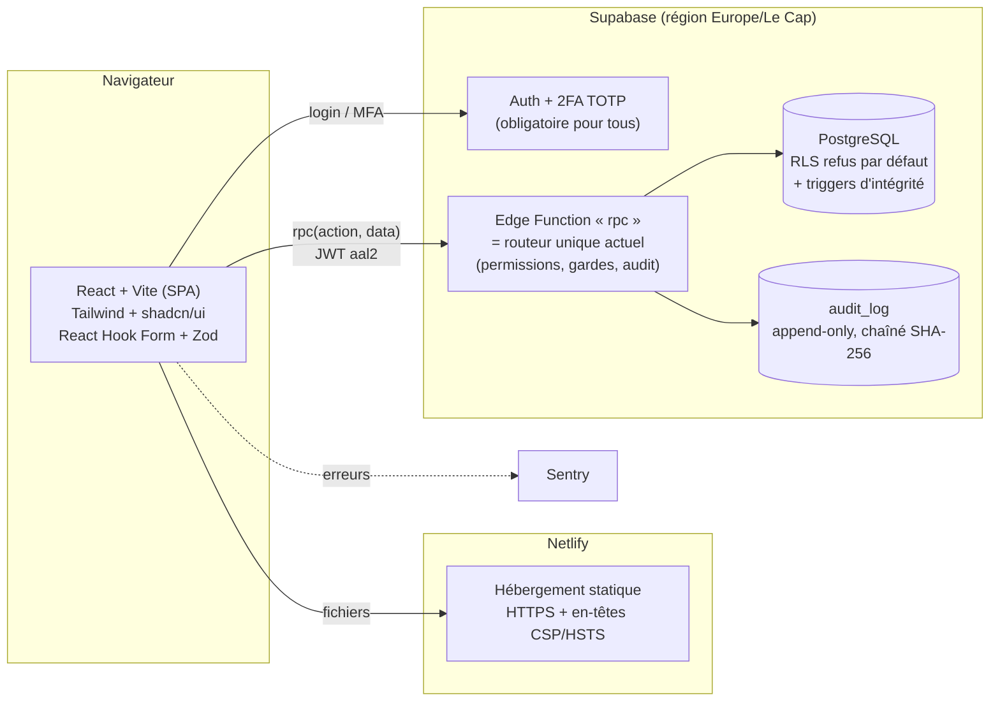

# CARGO TRACKER v4 — Dossier de conception

**PIA Dry Port (Adétikopé) — Migration Apps Script/Google Sheets → Application web sécurisée**

| | |
|---|---|
| **Version de référence métier** | Apps Script v3.6 (code du dossier `apps-script/`, lu intégralement le 15/07/2026) |
| **Principe directeur** | **ISO-FONCTIONNEL** : mêmes rôles, mêmes statuts, même moteur de workflow, mêmes règles, mêmes écrans. Aucun changement de comportement sans décision explicite. |
| **Stack verrouillée** | React + Vite + TypeScript · Supabase (PostgreSQL + Auth 2FA + Edge Functions) · Netlify · Tailwind + shadcn/ui · Zod · Sentry |
| **Données** | Import de l'historique des Google Sheets |

---

## 1. Principes de conception

1. **Fidélité stricte à la v3.6.** Le code Apps Script est la spécification. Chaque action RPC, chaque garde-fou, chaque message d'erreur est transposé tel quel.
2. **Défense en profondeur.** Deux couches indépendantes : (a) la logique métier serveur (Edge Functions = le routeur `rpc` actuel), (b) la base PostgreSQL qui **refuse tout par défaut** (RLS). Le navigateur n'a jamais d'accès direct en écriture aux tables.
3. **Le client ne décide jamais des droits** (règle déjà en vigueur) : le front n'est qu'un affichage ; toute vérification de rôle, de statut et d'étape se fait côté serveur.
4. **Zéro maintenance.** Services managés uniquement, TypeScript + Zod (erreurs attrapées à la compilation), sauvegardes automatiques, alertes Sentry.
5. **Contrats identiques.** Les actions gardent **les mêmes noms** (`cargo.cfs`, `report.kpi`…), les mêmes payloads et les mêmes formes de réponse ('Oui'/'Non', 'Yes'/'No', dates ISO…) → on peut tester la parité écran par écran avec l'ancienne appli.

---

## 2. Architecture cible



**Points clés :**

- **Une seule porte d'entrée métier** : l'Edge Function `rpc` reproduit le `rpc(action, token, data)` actuel — validation session (JWT Supabase, niveau **aal2** = 2FA vérifié), matrice `PERMISSIONS`, dispatch, `{ok:true,data}` / `{ok:false,error,auth}`.
- **RLS = filet de sécurité** : aucune table n'est lisible/modifiable par le rôle `authenticated` (tout passe par la fonction, qui utilise la clé service côté serveur uniquement). Si un jour une faille exposait PostgREST, la base refuse quand même.
- **Moteur de workflow partagé** : un paquet TypeScript `domaine/` (statuts, `etatCellules`, `etapesEnAttente`, schémas Zod) importé à la fois par le front (affichage) et l'Edge Function (autorité) — exactement le modèle actuel serveur + miroir client, mais avec **un seul code source** au lieu de deux copies.

### Arborescence du projet

```
cargo-tracker/
├─ apps/web/                  # React + Vite (déployé sur Netlify)
│  ├─ src/screens/            # 1 fichier par écran (mêmes écrans que TITLES actuel)
│  ├─ src/components/         # UI partagée (tables, cartes stats, modales détail…)
│  └─ src/lib/rpc.ts          # client RPC (fetch → Edge Function)
├─ packages/domaine/          # ← LE CŒUR : constantes, statuts, moteur d'étapes, Zod
├─ supabase/
│  ├─ migrations/             # schéma SQL versionné
│  └─ functions/rpc/          # Edge Function unique (Deno) : routeur + métier
│     ├─ actions/             # 1 module par famille (cargo, stock, annonce, report, user…)
│     └─ permissions.ts       # matrice PERMISSIONS (copie conforme)
├─ scripts/migration/         # import ponctuel Google Sheets → PostgreSQL
└─ netlify.toml               # en-têtes de sécurité + SPA redirect
```

---

## 3. Schéma PostgreSQL

Transposition des 8 feuilles actuelles. Les champs JSON des Sheets deviennent des colonnes **jsonb** (mêmes structures internes). Les dates deviennent `timestamptz`, les booléens 'Oui'/'Non' restent stockés tels quels **au niveau API** mais sont typés proprement en base (la couche RPC fait la conversion, le client ne voit aucune différence).

### 3.1 Types énumérés

```sql
create type role_utilisateur as enum
  ('CFS','CHEF_BRIGADE','CHEF_BRIGADE_ADJOINT','CHEF_VISITE','CHEF_DIVISION',
   'T1','BALISE','BON_SORTIE','PP','ADMIN');

create type statut_cargaison as enum
  ('Camion créé','En cours de chargement','Véhicule ouillage créé','Créée',
   'T1 saisi','GPS Installé','Bon de sortie émis','Sortie Enregistrée');

create type type_operation as enum
  ('Dépotage','Enlèvement','Dépotage / Véhicule','Conso (type C)','Sortie Magasin / MAD');

create type etat_sortie_cfs as enum ('En cours de chargement','Fin de chargement','Vide');
create type statut_stock    as enum ('En stock','Positionné','Dépoté');
create type statut_annonce  as enum ('Annoncé','Pointé','Confirmé');
```

> Les libellés français sont conservés à l'identique (compatibilité des données migrées, des exports et des écrans). Voir incohérence **I-9** sur la collision de libellés — résolue ici par deux enums distincts.

### 3.2 Utilisateurs — `profils`

L'authentification passe à **Supabase Auth** (comptes + mots de passe gérés par Supabase, hachage bcrypt, 2FA TOTP). La table `profils` porte les métadonnées métier :

```sql
create table profils (
  id                  uuid primary key references auth.users(id) on delete cascade,
  username            text not null unique,       -- identifiant court affiché (ex. 'kodjo.a')
  nom_complet         text not null,
  role                role_utilisateur not null,
  actif               boolean not null default true,
  date_creation       timestamptz not null default now(),
  derniere_connexion  timestamptz
);
```

- **2FA TOTP obligatoire pour tous** : l'Edge Function refuse toute action si le JWT n'est pas au niveau `aal2`. Écran d'enrôlement (QR code) au premier login + **codes de récupération** ; l'ADMIN peut réinitialiser le 2FA d'un agent (`user.resetmfa`, nouvelle action, équivalente en esprit à `user.resetpwd`).
- Un compte désactivé (`actif=false`) est bloqué au niveau de l'Edge Function ET banni côté Auth (`banned_until`).
- Équivalences : `user.create/update/toggle/resetpwd`, `account.changepwd` → mêmes actions, implémentées via l'API admin Supabase (jamais exposée au client).

### 3.3 Cargaisons — `cargaisons`

Reprend **toutes** les colonnes de `COLS` (v3.6). Extraits significatifs :

```sql
create table cargaisons (
  id                       text primary key,             -- 'CT-2026-000123'
  reference                text not null,
  date_creation            timestamptz not null default now(),
  numero_camion            text not null,
  numero_camion_norm       text generated always as
                             (upper(regexp_replace(numero_camion,'[^A-Za-z0-9]','','g'))) stored,
  type_operation           type_operation,
  twins                    boolean not null default false,
  -- Déclaration de référence (1ʳᵉ déclaration du camion)
  declarant                text, contact_declarant text, destination_marchandise text,
  bureau_declaration       text, type_declaration text, numero_declaration text,
  annee_declaration        text, description_marchandise text,
  observations_cfs         text, agent_cfs text, agent_cfs_id uuid references profils(id),
  statut                   statut_cargaison not null,
  -- Balise
  numero_gps text, date_pose_gps timestamptz, agent_balise text, agent_balise_id uuid,
  observations_balise text, balise_requise boolean, t1_correct boolean,
  numero_dispense text,
  -- Sortie PP
  infos_validees boolean, date_sortie timestamptz, agent_pp text, agent_pp_id uuid,
  observations_pp text, pp_checklist jsonb,               -- {cfs,t1,balise,bs}
  derniere_maj             timestamptz not null default now(),
  -- Rapport / conteneurs
  rapport_id               text not null,                 -- 'RPT-2026-000045'
  conteneurs_details       jsonb,        -- {conteneurs:[…], scellesCamion:[…]} (2 formes historiques gérées)
  nb_conteneurs            integer not null default 0,
  chargement_mixte         boolean not null default false,
  mixte_details            jsonb,        -- historique des compléments
  -- Véhicule
  est_vehicule             boolean not null default false,
  vehicule_details         jsonb,        -- {chassis,marque,modele,couleur,destination,extra[]}
  conteneur_origine        text,
  -- T1
  bureau_destination text, t1_numeros jsonb, date_t1 timestamptz,
  agent_t1 text, agent_t1_id uuid, observations_t1 text,
  -- Bon de sortie
  bon_sortie_numero        jsonb,        -- chaîne (dépotage) OU liste {conteneur,t1,numero} (enlèvement)
  date_bon_sortie timestamptz, agent_bon_sortie text, agent_bon_sortie_id uuid,
  observations_bon_sortie  text,
  -- Sauts de cellule + dispense
  saute_t1 boolean not null default false, saute_balise boolean not null default false,
  saute_bs boolean not null default false,
  arrivee_bureau boolean not null default false,
  date_arrivee_bureau timestamptz, agent_arrivee_bureau text,
  -- Entrée / état de sortie CFS
  routage_entree text, agent_entree text, agent_entree_id uuid,
  etat_sortie              etat_sortie_cfs,
  -- Validation chef brigade + colis + hors gabarit (CONFIDENTIEL)
  nb_colis                 text,
  hors_gabarit             boolean,                       -- confidentiel
  hauteur_chargement       text,                          -- confidentiel
  date_validation timestamptz, agent_validation text, agent_validation_id uuid,
  signature_validation     text,
  -- Ouillage (v3.6)
  ouillage_numero text, ouillage_date date
);

create index on cargaisons (statut);
create index on cargaisons (numero_camion_norm);
create index on cargaisons (date_creation desc);
create index on cargaisons (rapport_id);
create index on cargaisons (est_vehicule);
```

**Choix assumés (sans impact fonctionnel) :**

- Les colonnes d'aperçu `conteneur1..4 / plomb1..4` de la feuille **ne sont pas stockées** : elles sont **dérivées** de `conteneurs_details` par une vue (`v_cargaisons_resume`) qui renvoie exactement les mêmes champs qu'aujourd'hui. C'est la seule dé-duplication de stockage (les Sheets stockaient la même donnée 3 fois) ; l'API renvoie un résumé identique à `RESUME_KEYS`.
- Chaque « agent » garde le **nom affiché** (comme aujourd'hui) **plus** l'`uuid` du compte (traçabilité renforcée, invisible pour l'utilisateur).

### 3.4 Conteneurs — `conteneurs` (table normalisée, 1 ligne par conteneur)

```sql
create table conteneurs (
  id             bigint generated always as identity primary key,
  rapport_id     text not null,
  cargaison_id   text not null references cargaisons(id),
  numero_camion  text not null,
  type_operation text not null,
  ordre          integer not null,
  conteneur      text not null,       -- ISO 6346 : contrainte check ci-dessous
  scelle         text, taille text, type_conteneur text, poids text,
  champs_libres  text,                -- 'NOM=VALEUR ; …' (format d'export conservé)
  -- Déclaration PAR conteneur (v3.2/v3.4)
  numero_declaration text, annee_declaration text,
  bureau_declaration text, type_declaration text,
  date_creation  timestamptz not null default now(),
  constraint conteneur_iso6346 check (conteneur ~ '^[A-Z]{4}[0-9]{7}$')
);
create index on conteneurs (cargaison_id);
create index on conteneurs (conteneur);
```

### 3.5 Déclarations & apurement — `declarations`

```sql
create table declarations (
  cle                 text primary key,     -- 'ANNÉE|BUREAU|TYPE|NUMÉRO' (normalisé)
  annee_declaration   text, bureau_declaration text,
  type_declaration    text, numero_declaration text,
  declarant           text,
  nombre_conteneurs   integer not null,
  conteneurs_apures   integer not null default 0,
  date_creation       timestamptz not null default now(),
  derniere_maj        timestamptz not null default now()
);
```

L'apurement (`_majApurement_`, `_majApurementSafe_`, `_fixerNombreDeclare_`) devient de simples `insert … on conflict` / `update` **transactionnels** — les LockService disparaissent, PostgreSQL garantit l'atomicité.

### 3.6 Stock — `stock` et `stock_annonce`

```sql
create table stock (
  numero_tc         text primary key,      -- contrainte ISO 6346 identique
  taille text, type_conteneur text, provenance text,
  date_entree       timestamptz,
  statut            statut_stock not null default 'En stock',
  date_positionne timestamptz, date_pointage timestamptz, pointe_par text,
  date_depote timestamptz,
  cargaison_id      text references cargaisons(id),
  observations      text,
  nb_sejours_import integer not null default 0
);

create table stock_annonce (
  numero_tc          text primary key,
  taille text, date_entree timestamptz,
  annee_declaration text, bureau_declaration text,
  type_declaration text, numero_declaration text,
  statut             statut_annonce not null default 'Annoncé',
  date_annonce timestamptz not null default now(),
  date_pointage timestamptz, pointe_par text,
  date_confirmation timestamptz, confirme_par text,
  observations text
);
```

Tous les flux sont conservés : import journalier (mise à jour si déjà présent), pointage matinal **bloquant** si déjà pointé, chaîne Annoncé → Pointé (PP) → Confirmé (CFS, entrée effective au stock), `_lierStock_` (conteneur consommé → `Dépoté` + lien cargaison).

### 3.7 Journal d'audit — `audit_log` (append-only, chaîné)

```sql
create table audit_log (
  id            bigint generated always as identity primary key,
  ts            timestamptz not null default now(),
  user_id       uuid, username text, nom_complet text, role text,
  action        text not null,
  cargaison_id  text,
  details       text,
  prev_hash     text not null,               -- hash de la ligne précédente
  hash          text not null                -- sha256(prev_hash || ts || user || action || …)
);
-- Inviolabilité : un trigger calcule la chaîne ; UPDATE et DELETE sont interdits
revoke update, delete on audit_log from public, authenticated, anon;
create trigger audit_chain before insert on audit_log
  for each row execute function fn_audit_chain();  -- calcule prev_hash/hash, rejette toute rupture
```

- Mêmes colonnes fonctionnelles que la feuille `Historique` + la **chaîne de hachage** : toute suppression ou modification a posteriori casse la chaîne et devient détectable (fonction de vérification `audit.verify()` exécutable à tout moment).
- Comme aujourd'hui : la journalisation n'interrompt **jamais** l'opération métier (best-effort), et `log.list` reste ADMIN.

### 3.8 Séquences — `compteurs`

```sql
create table compteurs (cle text primary key, valeur bigint not null);
-- fn_next_ref('SEQ','CT') → 'CT-2026-000124'  (comportement identique :
-- compteur GLOBAL monotone, l'année ne réinitialise PAS la numérotation)
```

---

## 4. Modèle de sécurité

### 4.1 Authentification (Supabase Auth)

| Sujet | v3.6 (Apps Script) | v4 (cible) |
|---|---|---|
| Mot de passe | SHA-256 salé itéré ×5000, min. 6 caractères | **bcrypt (Supabase)**, min. **10 caractères** recommandé |
| Session | token 6 h en cache script | JWT court + refresh token, révocable |
| 2FA | — | **TOTP obligatoire pour tous** (aal2 exigé sur chaque action) + codes de récupération |
| Anti force-brute | 5 essais / 5 min par identifiant | Limitation Supabase + **Cloudflare Turnstile** sur le login |
| Comptes | feuille Utilisateurs | Supabase Auth + `profils` ; création/désactivation/reset par l'ADMIN uniquement |

> **Question ouverte (Q1)** : Supabase Auth identifie par **e-mail**. Deux options : (a) chaque agent a une adresse e-mail réelle (permet la récupération de compte) ; (b) identifiants internes convertis en e-mails techniques (`kodjo.a@cargo.pia.local`) — l'appli affiche seulement `username`, récupération via l'ADMIN. À trancher avant le Lot 1.

### 4.2 Autorisation — matrice `PERMISSIONS` (copiée à l'identique)

La matrice de `Config.gs` est reprise **telle quelle** (60 actions) dans `permissions.ts`, vérifiée par l'Edge Function avant tout dispatch, avec les mêmes messages (« Accès refusé pour votre profil. », « Session expirée… »). Synthèse par rôle :

| Rôle | Peut écrire | Lecture/rapports |
|---|---|---|
| **CFS** | createcamion, cfs, declaration, create (spéciaux), update, sceller, visite, mixte, etatcfs, ouillagedecl, stock.import/pointage/entreemagasin, stockannonce.confirmer, editcamion | tout + rapports CFS/véhicules/dwell/stock/annonce/kpi |
| **CHEF_BRIGADE** | valider (signature), horsgabarit, editcamion | listes, recherche, kpi, hors gabarit visible |
| **CHEFS adjoint/visite/division** | horsgabarit, editcamion | superviseurs : listes, kpi, hors gabarit visible |
| **T1** | t1, editcamion | file « En attente T1 » |
| **BALISE** | gps, arriveebureau, editcamion | file Balise, dispenses, rapport Balise |
| **BON_SORTIE** | bonsortie, editcamion | file BS |
| **PP** | sortie, stockannonce.pointage, editcamion | file sortie, rapport PP, annonce |
| **ADMIN** | tout (+ gpsedit exclusif, users, imports annonce) | tout (+ flux, historique, report.list) |

### 4.3 Confidentialité « Hors gabarit »

Reproduction exacte de `_filtrerConfidentiel_` + `VOIENT_HORSGABARIT` :

- `hors_gabarit` / `hauteur_chargement` sont retirés de la réponse `cargo.get` pour tout rôle ∉ {CFS, 4 chefs, ADMIN} ;
- jamais présents dans les résumés/listes (équivalent `RESUME_KEYS`) ;
- **renforcement structurel** : la vue `v_cargaisons_resume` n'expose pas ces colonnes du tout, et RLS interdit l'accès direct à la table — la confidentialité ne dépend plus d'un seul `delete obj.x`.

### 4.4 RLS et rôles PostgreSQL

```sql
alter table cargaisons enable row level security;   -- idem toutes les tables
-- AUCUNE policy pour anon / authenticated  ⇒  refus par défaut, partout.
-- Seule l'Edge Function (service_role) lit/écrit.
```

Le front n'utilise la clé `anon` **que** pour l'authentification. Toute la donnée transite par `rpc` — comme aujourd'hui où le client ne connaît pas le Sheet.

### 4.5 Sécurité de la plateforme

- `netlify.toml` : `Content-Security-Policy` stricte (script self uniquement, connexions limitées au domaine Supabase + Sentry), `Strict-Transport-Security`, `X-Content-Type-Options`, `Referrer-Policy`, `Permissions-Policy`.
- Secrets uniquement en variables d'environnement (Netlify/Supabase). La clé `service_role` n'existe **que** dans l'Edge Function.
- Sauvegardes : sauvegardes quotidiennes Supabase + **PITR** (plan Pro) — remplace `sauvegardeQuotidienne` (copie Drive, rotation 30).
- Supervision : Sentry (front + Edge Function) avec alerte e-mail.

---

## 5. Moteur de workflow (transcription exacte)

Le paquet `domaine/` transpose **mot pour mot** `_etatCellules_` / `_etapesEnAttente_` / `_prochaineEtape_` :

```
CFS (fin de chargement) → VALIDATION (chef brigade) → T1 → { BALISE ∥ BON DE SORTIE } → PP
```

```ts
// domaine/workflow.ts — utilisé par le front ET l'Edge Function (une seule source)
export function etatCellules(c: CargaisonResume) {
  const enCharge = [S.CAMION, S.CHARGEMENT, S.VEHICULE_OUILLAGE].includes(c.statut);
  return {
    cfs:    !enCharge,
    valide: c.sauteValidation === true || !!c.dateValidation,   // ⚠ voir I-2
    t1:     c.sauteT1 || !!c.dateT1,
    balise: c.sauteBalise || c.estVehicule || !!c.datePoseGPS,
    bs:     c.sauteBS || !!c.bonSortieNumero,
    sorti:  c.statut === S.SORTIE,
  };
}
// etapesEnAttente : CFS → VALIDATION → T1 → [BALISE, BS] → PP  (parallélisme conservé)
```

Toutes les **gardes serveur** sont conservées à l'identique : gate par `etapesEnAttente` (T1/Balise/BS/PP), exceptions ADMIN (« peut (ré)enregistrer sans faire reculer »), binôme 20', 2–3 scellés camion en dépotage, scellé conteneur obligatoire en enlèvement, T1 1:1 avec conteneurs distincts, checklist PP 4 cases (ou « infos validées » véhicule), hors gabarit automatique > 4,50 m, anti-doublon camion actif, stock Positionné exigé au dépotage, ouillage (T→T1, sinon PP direct), etc. — chaque `throw new Error('…')` garde **le même texte**.

**Différence d'implémentation (pas de comportement)** : les `LockService` + réécritures cellule par cellule deviennent des **transactions SQL** (`select … for update`) — plus de risque d'« Expiration du verrouillage », atomicité réelle.

---

## 6. Catalogue des actions RPC (60 actions + auth)

Toutes les entrées du routeur `Code.gs` sont reprises 1:1. Familles :

| Famille | Actions | Notes v4 |
|---|---|---|
| Lecture | `cargo.search/get/list/checkdup`, `dashboard.stats`, `etatcfs.list` | mêmes filtres (statut, étape, catégorie camion/véhicule, recherche, pagination), même tri, mêmes compteurs ; le cache 45 s devient inutile (SQL indexé) mais les formes de réponse ne changent pas |
| Flux d'entrée | `cargo.createcamion/cfs/declaration/sceller` | itératif conteneur par conteneur, déclaration par conteneur, saisie manuelle (conteneur partagé), stock Positionné |
| Spéciaux | `cargo.create` (Véhicule/Conso/Magasin), `cargo.ouillagedecl` | régimes déclaration/ouillage, ligne porteuse du conteneur d'origine |
| Cellules | `cargo.valider/horsgabarit/t1/gps/gpsedit/bonsortie/sortie/arriveebureau/etatcfs` | gardes identiques ; `gpsedit` ADMIN only |
| Corrections | `cargo.update/editcamion/mixte/visite` | mêmes droits et statuts autorisés |
| Déclarations | `decl.lookup` | clé année\|bureau\|type\|numéro + restant |
| Stock | `stock.list/import/pointage/entreemagasin`, `report.stock` | import .xlsx (SheetJS côté client → items JSON, comme aujourd'hui) |
| Stock annoncé | `stockannonce.import/list/pointage/confirmer`, `report.annonce` | flux 3 états |
| Rapports | `report.loading/cfs/cfsdetail/vehicule/vehiculedetail/balise/balisedetail/pp/ppdetail/kpi/dispenses/flux/fluxdetail/dwell/dwelldetail/list/history` | mêmes agrégats, mêmes cartes cliquables → détail → fiche |
| Admin | `log.list`, `user.list/create/update/toggle/resetpwd` | + **nouveau** `user.resetmfa` (réinitialisation 2FA par l'ADMIN) |
| Compte | `account.changepwd` | via Supabase Auth (ancien mot de passe exigé) |
| Auth | `login`, `logout` | remplacés par Supabase Auth + enrôlement/vérification TOTP |

### Exports (PDF / XLSX)

Aujourd'hui : classeur temporaire → export base64. En v4 :

- **XLSX** : généré par **exceljs** dans l'Edge Function (données 100 % serveur), téléchargé directement — mêmes feuilles (Récapitulatif + Détails par opération), mêmes colonnes.
- **PDF** : généré dans l'Edge Function (pdf-lib) à partir des **mêmes tableaux** ; le bon de chargement (`report.loading`) garde sa mise en page HTML → impression.

---

## 7. Écrans et navigation (reproduction de `MENUS`/`TITLES`/`SCREENS`)

Chaque écran actuel devient un composant React **au même endroit du menu, pour les mêmes rôles** — la liste ci-dessous est extraite du code client v3.6 :

| Rôle | Menu (identique) |
|---|---|
| **CFS** | Tableau de bord · Créer un camion · Saisir / compléter · Nouveau (Véhic./Conso/MAD) · Cargaisons · Véhicules · Recherche · État camions (sortie CFS) · Confirmer entrée (annoncé) · Stock CFS journalier · Stock conteneurs · Pointage matinal · Stock initial (import) · Stock annoncé · Entrée Magasin/MAD · Rapport CFS · Rapport véhicules · KPI/EVP · Camions en instance · Séjour conteneurs · Mon compte |
| **Chef brigade** | Tableau de bord · À valider · Cargaisons · Véhicules · Recherche · Mon compte |
| **Chefs adjoint/visite/division** | Tableau de bord · Cargaisons · Véhicules · Recherche · KPI/EVP · Mon compte |
| **T1** | Tableau de bord · Cellule T1 · En attente T1 · Recherche · Mon compte |
| **Balise** | Tableau de bord · Cellule Balise · En attente Balise · Dispenses · Recherche · Rapport Balise · Mon compte |
| **Bon de sortie** | Tableau de bord · Cellule Bon de Sortie · En attente BS · Recherche · Mon compte |
| **PP** | Tableau de bord · Pointage entrée (annoncé) · Stock annoncé · Sortie (checklist) · En attente sortie · Véhicules · Recherche · Rapport PP · Mon compte |
| **ADMIN** | tout (y c. Annonce de transfert — import, Analyse des flux, Historique, Utilisateurs) |

Sont conservés à l'identique : le **détail cargaison** (timeline 5 cellules + panneaux d'action conditionnels par rôle/étape), les **cartes cliquables → modale détail → fiche** (règle projet), les masques de saisie (`.tc` ISO 6346, `.tel`, MAJUSCULES automatiques), les avertissements de doublon au blur, la validation « premier champ manquant » (React Hook Form + Zod reproduit `validateRapport`), le tableau de bord filtrable jour/semaine/mois/année.

**Ajouts inévitables (nouveaux écrans, sans équivalent v3.6)** : enrôlement 2FA (QR + codes de récupération), saisie du code TOTP au login, page « réinitialiser le 2FA » côté ADMIN.

---

## 8. Migration des données (Sheets → PostgreSQL)

Script ponctuel `scripts/migration/` (TypeScript, exécuté une fois, hors production) :

1. **Entrée** : export `.xlsx` du classeur Google (8 onglets) — à fournir au moment de la migration.
2. **Cargaisons** : mapping colonne → colonne ; parsing des jsonb (`conteneursDetails` : les **2 formes historiques** — tableau simple ou `{conteneurs, scellesCamion}` — sont normalisées vers la 2e ; `vehiculeDetails`, `mixteDetails`, `t1Numeros`, `ppChecklist`, `bonSortieNumero` chaîne ou JSON) ; conversion 'Oui'/'Non'/'Yes'/'No' → booléens ; dates feuille → timestamptz (fuseau du script actuel).
3. **Conteneurs / Déclarations / Stock / StockAnnonce** : import direct + contrôles (ISO 6346, clés uniques ; les rejets sont listés dans un rapport de migration, jamais silencieux).
4. **Historique** : importé dans `audit_log` comme bloc « héritage » scellé (la chaîne de hachage démarre après la dernière ligne importée).
5. **Utilisateurs** : les comptes sont **recréés** dans Supabase Auth (les hachages actuels ne sont pas transposables) — chaque agent reçoit un mot de passe provisoire + enrôle son 2FA à la première connexion. Les rôles/noms viennent de la feuille.
6. **Compteurs** : `SEQ` et `SEQ_RPT` repris tels quels (les IDs continuent la numérotation actuelle).
7. **Vérification** : script de comptage croisé (totaux par statut, par opération, stocks par état, nb de conteneurs par cargaison) comparé aux chiffres du tableau de bord actuel avant bascule.

---

## 9. Plan de réalisation (lots testables)

| Lot | Contenu | Critère d'acceptation |
|---|---|---|
| **0 — Socle** | Repo, CI, projet Supabase (région), Netlify, `netlify.toml`, squelette apps/packages, Sentry | Page de login déployée en HTTPS avec en-têtes de sécurité |
| **1 — Auth** | Supabase Auth, enrôlement TOTP + codes de secours, écrans login/2FA/compte, `profils`, gestion utilisateurs ADMIN (`user.*`, resetmfa) | Connexion 2FA de bout en bout, comptes désactivables |
| **2 — Cœur cargaisons** | Schéma SQL complet, `domaine/` (workflow + Zod), Edge Function `rpc`, actions du flux principal (createcamion → cfs → declaration → valider → t1 → gps ∥ bonsortie → sortie) + listes/détail/recherche/stats | Un camion parcourt tout le circuit avec les 10 rôles, gardes identiques v3.6 |
| **3 — Stock & déclarations** | stock, stock annoncé (3 états), imports .xlsx, pointage matinal, decl.lookup/apurement, magasin temps 1 | Scénarios GUIDE_TEST sections stock/annonce rejoués |
| **4 — Spéciaux** | Véhicules (déclaration + ouillage), Conso, Magasin/MAD temps 2, mixte, visite, editcamion, gpsedit, arriveebureau, etatcfs | GUIDE_TEST sections H/H bis rejouées |
| **5 — Rapports & exports** | 17 rapports + exports XLSX/PDF + audit `log.list` | Chaque rapport comparé à l'ancien sur les mêmes données |
| **6 — Migration & bascule** | Script d'import, chaîne d'audit, vérification croisée, période de double-run, formation, bascule | Comptages identiques, GUIDE_TEST complet vert |

---

## 10. ⚠️ Incohérences et observations relevées (revue d'expert)

Relevées pendant la lecture intégrale du code v3.6. **Par défaut, la v4 reproduit le comportement actuel** ; chaque point est une décision à prendre (garder tel quel / corriger).

| # | Constat | Impact | Recommandation |
|---|---|---|---|
| **I-1** | **La signature du chef brigade ne fige pas le contenu.** `signatureValidation` = hash de (id + agent + date) uniquement. Après validation, la cargaison peut encore être modifiée sans invalider la signature : `cargo.cfs` accepte le statut « Créée » (ajout de conteneur post-validation), `editcamion` à tout statut, `visite`, `mixte`. | Intégrité de la validation douanière | **Corriger en v4** : signer aussi une empreinte du contenu (conteneurs, scellés, déclaration) et signaler « modifié après validation » ; option stricte = re-validation exigée. |
| **I-2** | **Champ fantôme `sauteValidation`** : lu par le moteur (`_etatCellules_`) mais aucune colonne ne l'écrit jamais — la condition est toujours fausse. | Aucun (code mort) | Soit créer la vraie colonne (utile pour d'éventuels régimes sans validation), soit retirer la condition. |
| **I-3** | **`cargo.editcamion` ouvert à TOUS les rôles, à TOUT statut**, y compris après la sortie. Journalisé, mais un agent T1 peut renommer un camion déjà sorti. | Anti-fraude | À confirmer : restreindre (ex. CFS + chefs + ADMIN, ou blocage après sortie) ou garder tel quel. |
| **I-4** | **Anti-doublon camion incomplet** : `_creerCamionVide_` refuse un camion actif en double, mais les créations Véhicule/Conso/Magasin (`cargo.create`) ne font pas ce contrôle (seul l'avertissement client `checkdup` existe). | Doublons possibles sur les flux spéciaux | Harmoniser (appliquer le même contrôle serveur) ou garder. |
| **I-5** | **Ré-import de l'annonce** : une ligne est protégée du rafraîchissement si « Pointé », mais **pas si « Confirmé »** — un ré-import écrase les champs déclaration d'un TC déjà entré au stock (le garde-fou n'a pas suivi l'ajout du 3e état en v3.1). | Données annonce écrasées après coup | **Corriger** : protéger Pointé ET Confirmé. |
| **I-6** | **`report.annonce` restreint [PP, CFS, ADMIN] mais route identique à `stockannonce.list` (tous rôles)** — la restriction est donc contournable par construction. | Cosmétique (les données ne sont pas sensibles) | Harmoniser les deux permissions. |
| **I-7** | **`cargo.horsgabarit` (saisie manuelle par les chefs) existe toujours côté serveur** alors que la v3.2 a rendu le hors gabarit automatique et supprimé l'UI. Action vivante sans écran. | Code mort accessible par API | Décider : retirer l'action ou la garder (compat). |
| **I-8** | **Exigences divergentes selon le chemin de saisie** : le flux principal (`cargo.cfs`) n'exige plus le Type de conteneur (v3.1), mais `cargo.create`/`cargo.update` (spéciaux + édition) l'exigent toujours ; le type de déclaration n'est pas validé contre la liste `T,C,S,A,E` côté serveur. | Incohérence UX + validation | Harmoniser (aligner sur le flux principal) ou garder. |
| **I-9** | **Collision de libellés** : « En cours de chargement » est à la fois un **statut** de cargaison et un **état de sortie CFS**. | Risque de confusion (données/rapports) | Résolu structurellement en v4 (2 enums distincts) sans changer les libellés affichés. |
| **I-10** | **Sémantique « Dépoté » du stock** : un conteneur d'**enlèvement** consommé est aussi marqué « Dépoté » alors qu'il part plein. | Libellé trompeur dans l'écran Stock | Garder le comportement, éventuellement afficher « Sorti/Consommé » selon l'opération. |
| **I-11** | **Clé de déclaration sans le déclarant** : deux déclarants différents avec la même clé année/bureau/type/numéro partagent silencieusement la même ligne d'apurement (le 1er déclarant enregistré gagne). | Cas limite | Signaler (avertissement) si le déclarant diffère, sans bloquer. |
| **I-12** | **Améliorations de sécurité inhérentes à la migration** (pas des incohérences) : SHA-256 itéré → bcrypt ; session 6 h en cache → JWT + refresh révocables ; protection des feuilles « avertissement seulement » → RLS + audit chaîné ; verrous LockService → transactions SQL. | — | Automatiques avec la nouvelle stack. |

---

## 11. Questions ouvertes avant le Lot 1

1. **Q1 — Identifiants** : e-mails réels des agents ou identifiants internes (e-mails techniques) ? (§4.1)
2. **Q2 — Incohérences** : lesquelles corriger (recommandé : I-1, I-5, I-6 ; les autres à votre convenance) et lesquelles garder à l'identique ?
3. **Q3 — Région Supabase** : Europe (Francfort/Paris) ou Le Cap ? (latence vs. proximité — à confirmer, et revalider la question de la résidence légale des données avant la mise en production réelle.)
